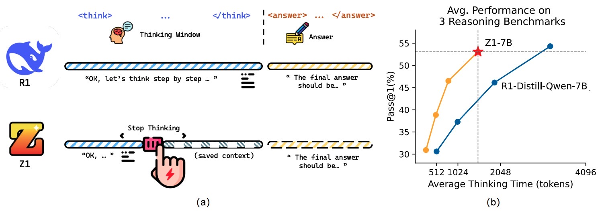
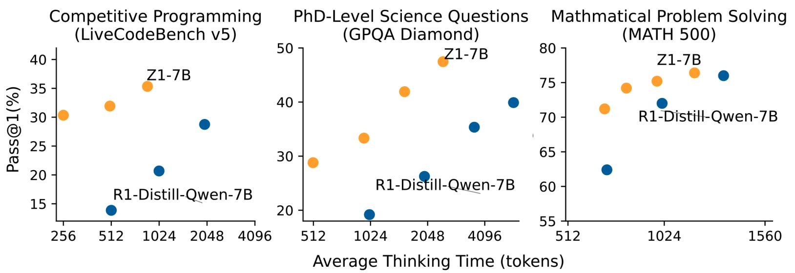
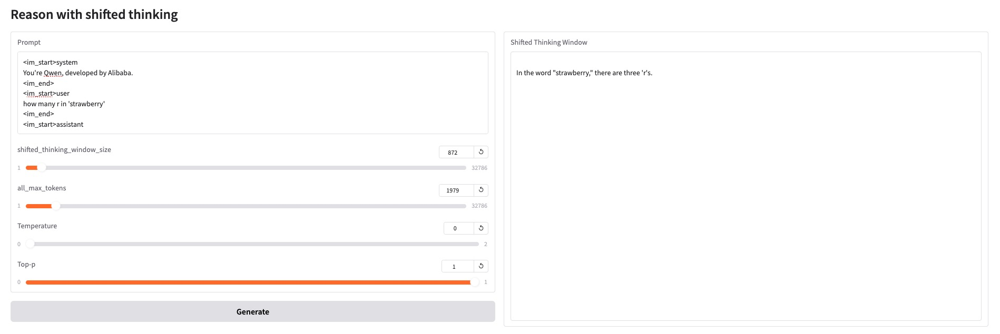
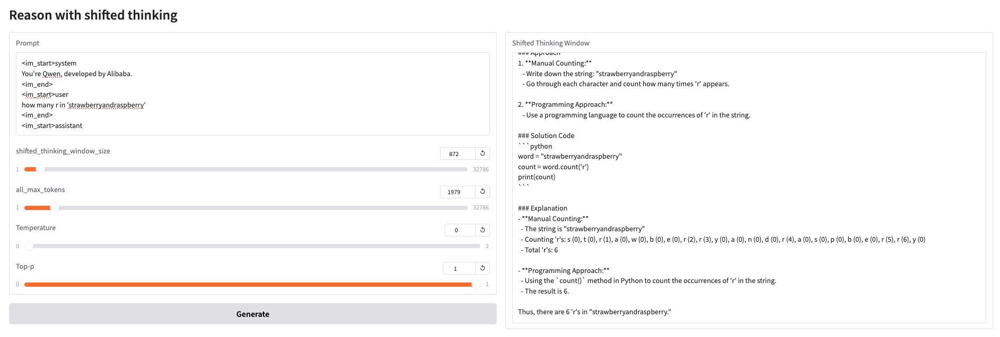

<div align="center">
  <h1 align="center">

<br>
Z1: Efficient Test-time Scaling with Code
</h1>
<p>Train Large Language Model to Reason with Shifted Thinking
</p>
</div>

<p align="center">
Repo for paper "<a href="https://arxiv.org/abs/2504.00810" target="_blank">Z1: Efficient Test-time Scaling with Code</a>"
</p>

<p align="center">
  <a href="https://arxiv.org/abs/2504.00810"><b>[📜 Paper]</b></a> •
  <a href="https://huggingface.co/efficientscaling/Z1-7B"><b>[🤗 HF Models]</b></a> •
  <a href="https://github.com/efficientscaling/Z1"><b>[🐱 GitHub]</b></a>
  <!-- <a href="https://9557c5365a6f44dc84.gradio.live"><b>[🐯 Gradio Demo]</b></a> -->
  <br>

  <!-- <a href="#-quick-start">Quick Start</a> • -->
  <!-- <a href="#%EF%B8%8F-citation">Citation</a> -->
</p>

<p align="center">
    
    
    <br>

</p>


<!-- <div align="center">

<div align="center" style="font-family: Arial, sans-serif;">
  <p>
    <a href="#updates" style="text-decoration: none; font-weight: bold;">Updates</a> •
    <a href="#links" style="text-decoration: none; font-weight: bold;">Links</a> •
    <a href="#getting-started" style="text-decoration: none; font-weight: bold;">Getting Started</a> •
    <a href="#introduction" style="text-decoration: none; font-weight: bold;">Introduction</a> •
    <a href="#evaluation" style="text-decoration: none; font-weight: bold;">Evaluation</a> •
    <a href="#citation" style="text-decoration: none; font-weight: bold;">Citation</a> 
  </p>
</div>

</div> -->


## Updates
<!-- - **[2025/04/01]** 🎉 We have released our [training data](https://huggingface.co/datasets/efficientscaling/Z1-Code-Reasoning-107K))! -->
- **[2025/04/01]** 🎉 We have released our [Z1-7B](https://huggingface.co/efficientscaling/Z1-7B) model and our [training data](https://huggingface.co/datasets/efficientscaling/Z1-Code-Reasoning-107K) through Huggingface!


<!-- # Links

- 🤗 [Z1 models](https://huggingface.co/efficientscaling/Z1-7B)
- 🤗 [Z1 data](https://huggingface.co/datasets/efficientscaling/Z1-Code-Reasoning-107K) -->

## Examples

<p align="center">
    
    <br>
    <em>Simple Reasoning</em>
    <br>
    
    <br>
    <em>Complex Reasoning</em>
    <br>

</p>

## Getting Started

We open source the code and scripts we used for data curation, training, and evaluation for Z1 models, you can find more details in each directory.

- ``src/eval``:  Evaluation scripts for Z1.
- ``src/data``:  Data abaltion scripts for Z1.
- ``scr/train``: Training scripts for Z1. We train Z1-7B with Fully Shard Data Parallel (FSDP) and set a global batch size to 128 for 2 epochs using 8 NVIDIA A100-80G GPUs.


## Gradio demo

Install `vllm` library firstly. We use `vllm==0.5.3.post1`.

```python
import copy
from typing import List
from dataclasses import dataclass

import gradio as gr
from vllm import LLM, SamplingParams
from transformers import  AutoTokenizer

BOX=r"\boxed{}"
ANSWER_WITH_BOX=f"\n\nI overthought it, the final answer in {BOX} should be:\n\n"
ANSWER_WITHOUT_BOX=f"\n\nI overthought it, the final answer should be:\n\n"

model_name = "efficientscaling/Z1-7B"

@dataclass
class ThinkingLLM(LLM):

    def __init__(self, *args, **kwargs):
        super().__init__(*args, **kwargs)

    def thinking_generate(self, prompts: List[str], sampling_params: SamplingParams = None, max_tokens_for_thinking: int = None):
        # If no SamplingParams is provided, create a default one
        if sampling_params is None:
            raise ValueError("Sampling_params can't be None!")
        else:
            all_max_tokens = sampling_params.max_tokens
            # Override the max_tokens in the provided SamplingParams with the budget
            sampling_params.max_tokens = max_tokens_for_thinking
            print(f"All tokens: {all_max_tokens}")
            print(f"Tokens for thinking: {max_tokens_for_thinking}")

        trajectories = self.generate(prompts, sampling_params)

        rethinking_str = ANSWER_WITHOUT_BOX
        sampling_params.max_tokens = all_max_tokens

        answers = copy.deepcopy(trajectories)

        unfinished_id = []
        thinking_token = 0
        new_prompts = []

        for id, traj in enumerate(trajectories):
            if traj.outputs[0].finish_reason == 'length':
                unfinished_id.append(id)
                new_prompts.append(prompts[id] + traj.outputs[0].text + rethinking_str)
            thinking_token += len(traj.outputs[0].token_ids)

        avg_thinking_token = thinking_token / len(prompts)

        if new_prompts:
            print(new_prompts[0])

            o = self.generate(
                new_prompts,
                sampling_params=sampling_params,
            )
            
        for i, uid in enumerate(unfinished_id):
            answers[uid] = o[i]

        return new_prompts, answers


def generate_text(prompt, max_tokens, max_tokens_for_thinking, temperature, top_p):

    sampling_params = SamplingParams(
        temperature=temperature,
        max_tokens=max_tokens,
        top_p=top_p,
        skip_special_tokens=False,
    )

    trajectories, outputs = llm.thinking_generate(prompt, sampling_params, max_tokens_for_thinking=max_tokens_for_thinking)

    return trajectories[0] + '\n\n' + outputs[0].outputs[0].text if trajectories else outputs[0].outputs[0].text


llm = ThinkingLLM(
    model=model_name,
    tensor_parallel_size=1,
    gpu_memory_utilization=0.96,
    )


with gr.Blocks() as demo:
    gr.Markdown("# Reason with shifted thinking")
    
    with gr.Row():
        with gr.Column():
            prompt_input = gr.Textbox(
                label="Prompt",
                placeholder="Input",
                lines=5,
            )
            max_tokens_for_thinking_input = gr.Slider(
                label="shifted_thinking_window_size",
                minimum=1,
                maximum=32786,
                value=4000,
                step=1,
            )
            max_tokens_input = gr.Slider(
                label="all_max_tokens",
                minimum=1,
                maximum=32786,
                value=32786,
                step=1,
            )
            temperature_input = gr.Slider(
                label="Temperature",
                minimum=00,
                maximum=2.0,
                value=0,
                step=0.1,
            )
            top_p_input = gr.Slider(
                label="Top-p",
                minimum=0.0,
                maximum=1.0,
                value=1,
                step=0.01,
            )
            generate_button = gr.Button("Generate")
        
        with gr.Column():
            output_text = gr.Textbox(
                label="Shifted Thinking Window",
                placeholder="Text is here...",
                lines=10,
            )
    
    
    generate_button.click(
        fn=generate_text,
        inputs=[prompt_input, max_tokens_for_thinking_input,max_tokens_input,  temperature_input, top_p_input],
        outputs=output_text, 
    )


if __name__ == "__main__":
    demo.launch()

```

## Inference

#### vLLM with Shifted Thinking Window


```python
import copy
from typing import List
from dataclasses import dataclass
from code_evaluation.reasoning import ThinkingLLM
from transformers import  AutoTokenizer

thinking_llm = ThinkingLLM(
    model='efficientscaling/Z1-7B',
    tensor_parallel_size=1,
    gpu_memory_utilization=0.96,
)
tokenizer = AutoTokenizer.from_pretrained('efficientscaling/Z1-7B')
stop_token_ids = tokenizer("<|im_end|>")["input_ids"]

prompts = [
    "Write a Python script to calculate the number of letter ’a’ and ’r’ in a string.",
]

prompts = ["<|im_start|>system\nPlease reason step by step.<|im_end|>\n<|im_start|>user\n" + p + "<|im_end|>\n<|im_start|>assistant\n" for p in prompts]

sampling_params = SamplingParams(
skip_special_tokens=False,
temperature=0.0,
top_p=1,
max_tokens=5000,
# stop_token_ids=stop_token_ids,
)
    
avg_thinking_tokens, o = thinking_llm.thinking_generate(
    prompts,
    sampling_params=sampling_params,
    max_tokens_for_thinking=4096
)

print(o[0].outputs[0])
print(avg_thinking_tokens)

```

## Training
If the dataset is too large, you can first find our script at `train/preprocess.py` to tokenize and save your dataset if the dataset too large.
Then run `train/script/train_qwen.sh`  launch training.

We train Z1-7B with Fully Shard Data Parallel (FSDP) and set a global batch size to 128 for 2 epochs using 8 NVIDIA A100-80G GPUs. You can downgrade the `max_tokens` in your training dataset to avoid OOM.

## Evaluation

We clone [LIMO](https://github.com/GAIR-NLP/LIMO) repository and modift its evaluation scipt to evaluate Z1 on MATH500 and GPQA.
Environment Setup:
```sh
cd eval/general_evaluation
pip install -r 'requirements.txt'
```
For LiveCodeBench and BigCodeBench, you can install the environment with following commands:
```sh
cd eval/code_evaluation/livecodebench
pip install -e .
```
and 
```sh
cd eval/code_evaluation/bigcodebench
pip install -r 'requirements.txt'
```
## Citation
```
@misc{yu2025efficientscaling,
      title={Z1: Efficient Test-time Scaling with Code}, 
      author={Zhaojian Yu and Yinghao Wu and Yilun Zhao and Arman Cohan and Xiao-Ping Zhang},
      year={2025},
      eprint={2504.00810},
      archivePrefix={arXiv},
      primaryClass={cs.CL},
      url={https://arxiv.org/abs/2504.00810}, 
}
```
